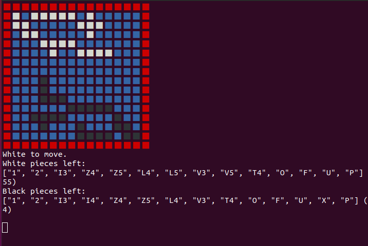

# SUNBLOK
A Blokus AI written in Ruby 3 (but maybe compatiable with 2)
Comes with a game engine and a N-ply minimax AI.
WIP.

limitations:
- can't rotate or flip pieces yet
- no alpha beta pruning
- eval() function is poor and can be improved.

to profile
ruby-prof engine/render.rb -p call_stack > result.html

to run (use truffleruby for best performance)
ruby engine/render.rb